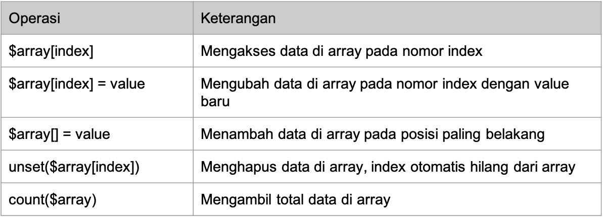

- adalah berisikan sekumpulan data, atau dapat pula berupa array kosong, dalam PHP array dapat berisikan data dengan berbagai jenis ( dapat berupa campuran data string dan integer sekaligus).

- Cara membuat array :

```zsh
<?php

$values = array(1, 2, 3, 4, 5); // dengan diawali kata kunci array
var_dump($values);
echo "\n";
$book = ['Math', 10, 'Biology', 7]; // menggunakan tanda []
var_dump($book);
```

_hasil :_

```zsh
array(5) {
  [0]=>
  int(1)
  [1]=>
  int(2)
  [2]=>
  int(3)
  [3]=>
  int(4)
  [4]=>
  int(5)
}

array(4) {
  [0]=>
  string(4) "Math"
  [1]=>
  int(10)
  [2]=>
  string(7) "Biology"
  [3]=>
  int(7)
}
```

- Operasi Array


