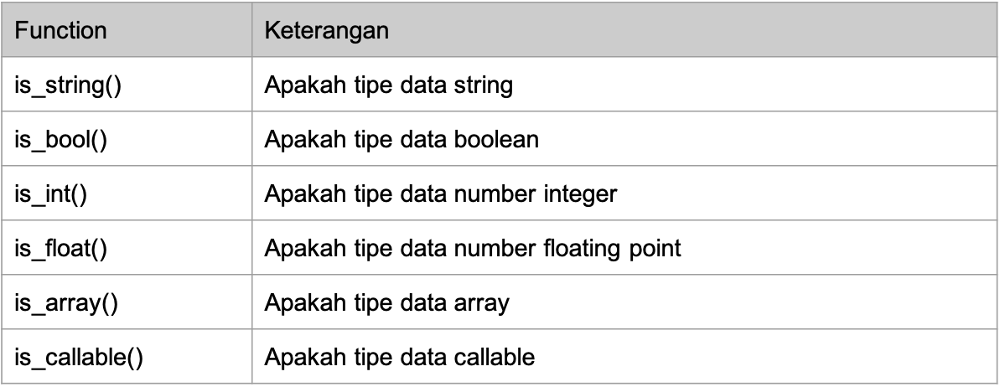

- Function-function ini rata-rata digunakan untuk mengecek tipe data dari sebuah data
  [Link](https://www.php.net/manual/en/ref.var.php)



```zsh
<?php

$data = "example";


var_dump(is_bool($data));
var_dump(is_string($data));
var_dump(is_int($data));
var_dump(is_float($data));
var_dump(is_array($data));
var_dump(is_callable($data));
var_dump(is_null($data));
```

_hasil :_

```zsh
bool(false)
bool(true)
bool(false)
bool(false)
bool(false)
bool(false)
bool(false)
```
